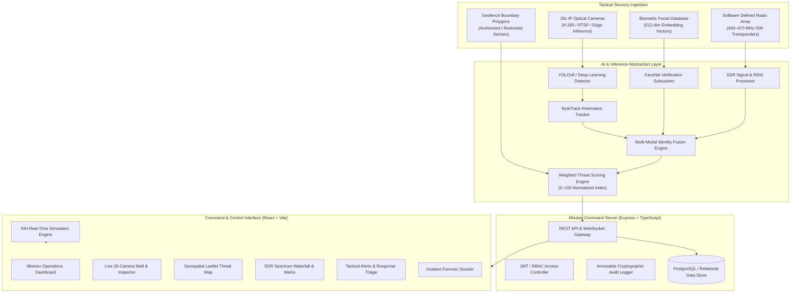

# SURAKSHA-NET (सुरक्षा-नेट)
### AI-Powered Border Intelligence & Perimeter Security Platform
**Smart India Hackathon (SIH) Problem Statement ID: 26187**

---

## 1. Project Overview

**SURAKSHA-NET** is an intelligent, multi-sensor command and control surveillance platform built for border security forces, defence installations, and high-security restricted perimeters. 

It addresses the fundamental limitations of single-modal surveillance (e.g. CCTV optical failure in low-light, camera blind spots, or RF spoofing) by establishing a **Zero-Trust Multi-Modal Correlation Doctrine**:
1. **Continuous Computer Vision Analytics**: Real-time human detection, kinematic ByteTrack tracking, and biometric facial identification.
2. **Authorized RF Transponder Pairing**: On-duty patrol personnel carry encrypted radio-frequency (RF) beacons. The system dynamically correlates optical tracks with localized RF signal telemetry.
3. **Multi-Factor Geofencing**: Virtual polygonal zones classify terrain into Authorized Corridors, Buffer Zones, and Restricted Munitions Sectors.
4. **Weighted Threat Engine (0–100)**: Aggregates visual identity verification, RF beacon presence, geofence compliance, and schedule synchronization to classify threats into `LOW`, `MEDIUM`, `HIGH`, or `CRITICAL`.

> **Core Doctrine**: RF signals are treated as supporting identity evidence and are correlated with optical detection, biometric verification, and spatial geofencing rather than being used as standalone proof.

---

## 2. System Architecture



---

## 3. Tech Stack

- **Frontend**: React 18, TypeScript, Vite, Tailwind CSS v3, Lucide Icons, Recharts, React-Leaflet, Zustand State Store.
- **Backend**: Node.js, Express, TypeScript, JWT Auth, REST API Abstractions.
- **AI Abstraction**: Modular interfaces for Object Detection, Kinematic Tracking, Biometric Facial Recognition, SDR RF Processing, and Threat Scoring.
- **Database**: PostgreSQL schema with relational constraints and JSONB spatial geometry support (ready for migration).

---

## 4. Folder Structure

```text
suraksha-net/
├── client/                      # Frontend Application
│   ├── src/
│   │   ├── components/          # Reusable UI & tactical components
│   │   │   ├── surveillance/    # Canvas-based simulated camera feeds & fusion panels
│   │   │   └── ui/              # UI primitives
│   │   ├── data/                # Comprehensive mock data models
│   │   ├── layouts/             # DashboardLayout & AuthLayout
│   │   ├── pages/               # 10 Command Pages + Landing + 404
│   │   │   ├── Landing.tsx      # Overview & SIH PS 26187 summary
│   │   │   ├── Login.tsx        # Authority login with role presets
│   │   │   ├── Dashboard.tsx    # Command center KPIs & feed quadrant
│   │   │   ├── Surveillance.tsx # 26-camera grid & inspector
│   │   │   ├── MapView.tsx      # Leaflet geospatial threat map
│   │   │   ├── RFMonitoring.tsx # SDR spectrum waterfall & correlation
│   │   │   ├── Alerts.tsx       # Alert triage & confirmation modals
│   │   │   ├── Personnel.tsx    # Personnel roster & transponder pairing
│   │   │   ├── Incidents.tsx    # Forensic audit timeline & dossiers
│   │   │   ├── Analytics.tsx    # Recharts metrics & threat trends
│   │   │   ├── SystemHealth.tsx # Subsystem percentages & heartbeat
│   │   │   └── Settings.tsx     # Threat scoring weights & audit logs
│   │   ├── store/               # Zustand authStore & simulationStore
│   │   └── App.tsx              # Routing and simulation ticker
│   └── package.json
│
├── server/                      # Backend REST API Server
│   ├── src/
│   │   ├── config/              # Server configuration
│   │   ├── middleware/          # JWT & Error handlers
│   │   └── server.ts            # Express server with REST endpoints
│   └── package.json
│
├── ai-engine/                   # AI Engine Abstraction
│   ├── detection/               # PersonDetector & MockPersonDetector
│   ├── tracking/                # PersonTracker & MockPersonTracker (ByteTrack)
│   ├── recognition/             # FaceRecognizer & MockFaceRecognizer
│   ├── rf-correlation/          # RFSignalProcessor & MockRFProcessor
│   └── inference/               # ThreatScoringEngine & IdentityCorrelationEngine
│
├── database/
│   └── schema/schema.sql        # Production-grade PostgreSQL DDL schema
│
├── shared/types/index.ts        # Single source of truth TypeScript types
├── .env.example
├── README.md
└── package.json                 # Workspace root runner
```

---

## 5. Demo Credentials

The platform provides pre-configured role presets directly on the login screen:

| Role | Service ID / Username | Passcode | Clearance Level |
|---|---|---|---|
| **Commander** (Default) | `IND-CMD-001` | `suraksha2024` | Level 4 / Top Secret |
| **Security Officer** | `IND-OFF-042` | `suraksha2024` | Level 3 / Operational |
| **Super Admin** | `IND-ADM-099` | `suraksha2024` | Level 5 / Full Master |

---

## 6. SIH Presentation & Jury Scenarios

### Command Demo Mode (10-Step Guided Flow)
Click **"Command Demo"** in the sidebar at any time to activate the step-by-step jury walkthrough:
1. `Step 1`: Authorized patrol detected on CAM-01.
2. `Step 2`: AI facial recognition matches biometric database (97%).
3. `Step 3`: Authorized RF beacon (RF-0012) correlated via SDR.
4. `Step 4`: Multi-factor confidence reaches 98% (AUTHORIZED).
5. `Step 5`: Unrecognized individual breaches Restricted Sector-03.
6. `Step 6`: Face match fails (12%).
7. `Step 7`: No authorized RF signal detected.
8. `Step 8`: Threat score elevates to 87% (CRITICAL).
9. `Step 9`: Critical alarm dispatched to duty officers.
10. `Step 10`: Incident dossier logged and acknowledged.

### 5 Pre-Built Scenarios (Quick-trigger buttons S1 to S5):
- **S1 (Normal Patrol)**: Verified patrol with matched optical face & RF beacon.
- **S2 (Unknown Person)**: Unidentified person detected in perimeter corridor (HIGH alert).
- **S3 (RF Mismatch)**: Authorized person detected but transponder ID does not match shift roster.
- **S4 (Camera Failure)**: CAM-04 goes offline; system degrades gracefully and boosts adjacent RF weighting.
- **S5 (Poor Visibility)**: Face recognition confidence drops; system increases reliance on RF & kinematics.

---

## 7. Installation & Quick Start

### Prerequisites
- Node.js (v18 or higher)
- npm

### 1. Install Dependencies
```bash
# From workspace root:
cd client && npm install
cd ../server && npm install
```

### 2. Run Application
```bash
# Terminal 1 — Start Backend Server (Port 3001)
cd server
npm run dev

# Terminal 2 — Start Frontend Client (Port 5173)
cd client
npm run dev
```

Open `http://localhost:5173` in your browser.

---

## 8. AI Engine Integration Guide (Production Roadmap)

To swap the simulated mock inference engines with real deep learning models:
1. **Object Detection**: Implement `PersonDetector` using ONNX Runtime with a quantized `yolov8n.onnx` model.
2. **Tracking**: Implement `PersonTracker` wrapping the C++ or Python `ByteTrack` Kalman filter library.
3. **Face Recognition**: Implement `FaceRecognizer` utilizing `FaceNet-512` with cosine distance matching against pre-enrolled PostgreSQL vector embeddings.
4. **Software-Defined Radio**: Connect a USRP B200 / RTL-SDR via GNU Radio to stream raw IQ telemetry into `RFSignalProcessor`.
